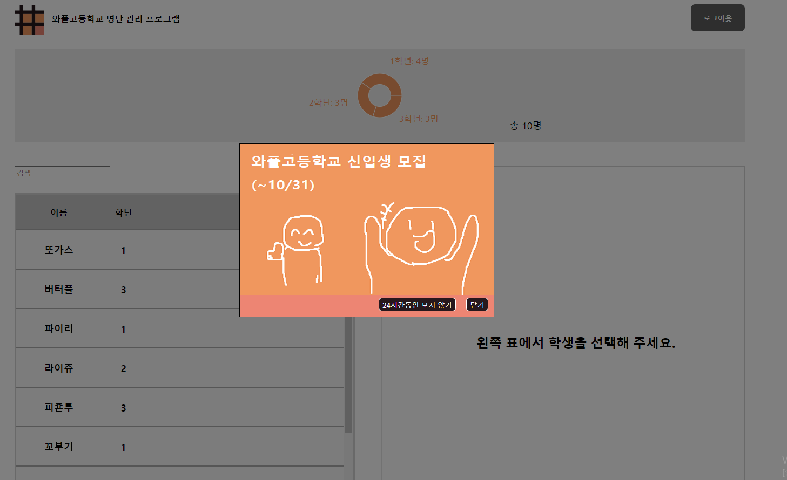
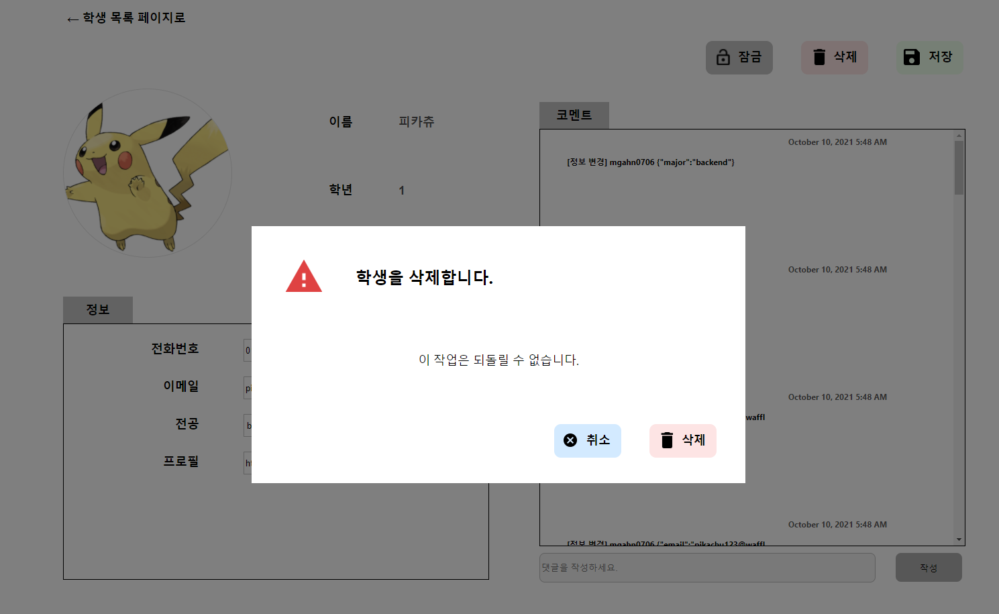

# 와플고등학교 명단관리 프로그램
### by mgahn0706(안민규)

 

### 개발환경
JetBrain Webstorm  2021.2  

###배포
<a href="https://dmmf4m1rp4w0q.cloudfront.net">dmmf4m1rp4w0q.cloudfront.net</a>

###사용 라이브러리
<ul>
    <li>dayjs: Luxon이 time-zone 변경에 있어서 약간 빠르지만, dayjs가 통계적으로 더 많이 쓰이며, time-zone 변경은 사용하지 않았으므로 범용성이 있는 dayjs를 선택함</li>
    <li>cookie-universal: react-cookie의 통합버전으로 cookie를 다루는 method가 편리하였음</li>
</ul>

###Components (Used States)
<ul> 
    <li> Header </li>
    <li> PopUp </li>
    <li> Routes </li>
    <li> DashBoard </li>
    <li> Modal (name, grade, profile: 추가하는 학생의 정보)</li>
    <li> Search</li>
    <li> StudentAdder</li>
    <li> StudentDetail</li>
    <li> StudentList
        <ul>
            <li>StudentItem (isChecked: 선택버튼을 눌렀는지에 대한 상태)</li>
        </ul>
    </li>
    <li> StudentPage
<ul>
            <li>Confirm (isChecked: 선택버튼을 눌렀는지에 대한 상태)</li>
        </ul></li> (newProfile, newPhone, newEmail, newMajor: 변경 상태)
(isLocked: 잠금 여부를 편하게 관리)
(isConfirmVisible: 삭제 modal 관리)
<li> </li>

</ul>

###Context

<ul>
    <li>StudentContext</li> (선택 학생 관리, 단순 prop으로 변경 예정)
    <li>AuthContext</li> (로그인 토큰, 로그인/로그아웃 함수를 저장)
</ul>

###Screenshots (Seminar 3)

학생 세부 정보화면

24시간 팝업창

삭제 modal

