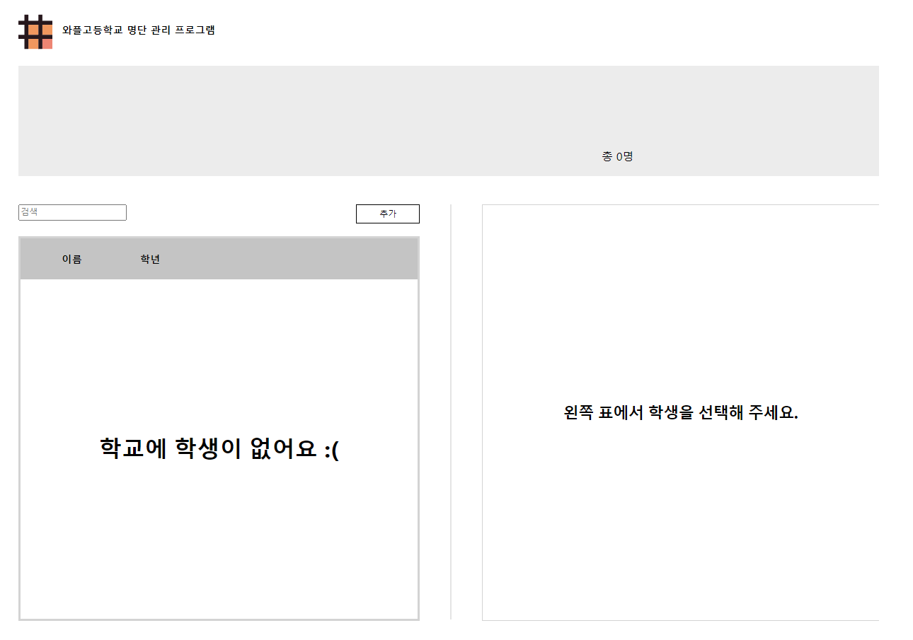

# 와플고등학교 명단관리 프로그램
### by mgahn0706(안민규)

 

### 개발환경
JetBrain Webstorm  2021.2  

###배포

###Components (Used States)
<ul> 
    <li> Header </li>
    <li> DashBoard </li>
    <li> Modal (name, grade, profile: 추가하는 학생의 정보)</li>
    <li> Search</li>
    <li> StudentAdder</li>
    <li> StudentDetail</li>
    <li> StudentList
        <ul>
            <li>StudentItem (isChecked: 선택버튼을 눌렀는지에 대한 상태)</li>
        </ul>
    </li>
    <li> StudentPage
<ul>
            <li>Confirm (isChecked: 선택버튼을 눌렀는지에 대한 상태)</li>
        </ul></li> (newProfile, newPhone, newEmail, newMajor: 변경 상태)
(isLocked: 잠금 여부를 편하게 관리)
(isConfirmVisible: 삭제 modal 관리)
<li> </li>

</ul>

###Context

<ul>
    <li>StudentContext</li> (학생 리스트 관리)
    <li>FilterContext</li> (필터를 저장)
    <li>SelectedStudentContext</li> (선택된 학생의 정보를 저장)
    <li>LoginContext</li> (로그인 여부를 저장함)
</ul>

</ul>

###Screenshots

메인화면

.png)
메인화면(선택됨)

학생 세부 정보화면

학생 세부 정보화면(잠김)

삭제 modal

